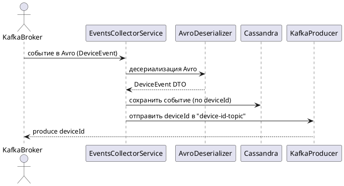

# Events Collector Service

## Описание

Events Collector Service - это микросервис для сбора и обработки событий от IoT устройств. Сервис получает события из Kafka, сохраняет их в Cassandra и публикует новые device ID для дальнейшей обработки.

## Архитектура

### Диаграмма компонентов

[events-collector-service-components.puml](../architecture/diagrams/events-collector-service/events-collector-service-components.puml)

```plantuml
@startuml events-collector-service-components
!include https://raw.githubusercontent.com/plantuml-stdlib/C4-PlantUML/master/C4_Component.puml

title Component diagram for Events Collector Service

Container_Boundary(ecs, "Events Collector Service") {
    Component(consumer, "DeviceEventsListener", "Spring Component", "Обрабатывает события устройств из Kafka")
    Component(publisher, "DeviceIdPublisher", "Spring Service", "Публикует новые device ID в Kafka")
    Component(repository, "DeviceEventRepository", "Spring Data Repository", "Управляет данными событий в Cassandra")
    Component(cache, "DeviceIdCache", "Caffeine Cache", "Кэширует опубликованные device ID")
    
    ComponentDb(cassandra, "Cassandra", "Apache Cassandra", "Хранит события устройств") #lightgray
    ComponentQueue(kafka_input, "Kafka Input Topic", "Apache Kafka", "Входящие события устройств") #lightgray
    ComponentQueue(kafka_device_id, "Kafka Device ID Topic", "Apache Kafka", "Новые device ID") #lightgray
}

Rel(consumer, kafka_input, "Читает события батчами", "Kafka Consumer")
Rel(consumer, repository, "Сохраняет события", "Spring Data")
Rel(consumer, publisher, "Публикует device ID", "Spring Service")
Rel(publisher, cache, "Проверяет кэш", "Caffeine")
Rel(publisher, kafka_device_id, "Публикует device ID", "Kafka Producer")
Rel(repository, cassandra, "CRUD операции", "Spring Data Cassandra")

note top of publisher
  Публикует только новые
  device ID (дедупликация)
end note

note right of cache
  Кэш для уникальных device ID.
  Автоочистка старых записей по TTL (1140 min default)
end note

@enduml
```
### Sequence диаграмма

[events-collector-service-sequence.puml](../architecture/diagrams/events-collector-service/events-collector-service-sequence.puml)



### Основные компоненты

1. **DeviceEventsListener** - Kafka consumer, обрабатывает батчи событий
2. **DeviceIdPublisher** - публикует новые device ID в Kafka с дедупликацией
3. **DeviceEventRepository** - Spring Data репозиторий для работы с Cassandra
4. **DeviceIdCache** - Caffeine кэш для хранения опубликованных device ID

## Функциональность

### Основные возможности

- **Пакетная обработка событий** - получение событий батчами из Kafka для повышения производительности
- **Сохранение в Cassandra** - события сохраняются в NoSQL базе данных с оптимизированной схемой
- **Дедупликация device ID** - публикация только новых device ID с использованием кэша
- **Мониторинг и метрики** - полная интеграция с Prometheus, Grafana и OpenTelemetry
- **Автоматическое восстановление** - обработка ошибок и retry механизмы

### Схема данных

События хранятся в Cassandra с использованием составного ключа:
- **Partition Key**: `device_id` - для равномерного распределения данных
- **Clustering Key**: `event_id` - для сортировки событий по времени

## Конфигурация

### Основные настройки

```yaml
server:
  port: 8090

app:
  topics:
    input: events                    # Входящий топик Kafka
    deviceId: device-id-topic        # Топик для новых device ID
  cache:
    deviceIdTtl: 1440               # TTL кэша в минутах (24 часа)

spring:
  kafka:
    consumer:
      group-id: ecs-consumer
      concurrency: 3                # Количество потоков обработки
  cassandra:
    keyspace-name: ecs
    contact-points: cassandra:9042
```

### Переменные окружения

| Переменная | Описание | По умолчанию |
|------------|----------|--------------|
| `INPUT_TOPIC` | Входящий топик Kafka | `events` |
| `DEVICE_ID_TOPIC` | Топик для device ID | `device-id-topic` |
| `KAFKA_CONSUMER_GROUP` | Группа Kafka consumer | `ecs-consumer` |
| `KAFKA_CONCURRENCY` | Количество потоков | `3` |
| `DEVICE_ID_TTL_MINUTES` | TTL кэша в минутах | `1440` |

## API Endpoints

### Actuator Endpoints

Сервис предоставляет полный набор Spring Boot Actuator endpoints:

- **Health Check**: `GET /actuator/health`
- **Метрики**: `GET /actuator/metrics`
- **Prometheus метрики**: `GET /actuator/prometheus`
- **Информация о приложении**: `GET /actuator/info`

### Примеры запросов

```bash
# Проверка состояния сервиса
curl http://localhost:8090/actuator/health

# Получение метрик
curl http://localhost:8090/actuator/metrics

# Prometheus метрики
curl http://localhost:8090/actuator/prometheus
```

## Мониторинг

### Метрики

Сервис экспортирует следующие метрики:

- **Kafka Consumer метрики** - количество обработанных сообщений, латентность
- **Cassandra метрики** - время выполнения запросов, количество операций
- **JVM метрики** - использование памяти, GC статистика
- **HTTP метрики** - время ответа actuator endpoints
- **Кэш метрики** - hit/miss ratio, размер кэша

### Дашборды

В Grafana доступен предустановленный дашборд "Event Collector Service Dashboard" с визуализацией:
- Производительности Kafka consumer
- Статистики Cassandra операций
- JVM метрик
- Кэш статистики

## Разработка

### Сборка

```bash
./gradlew build
```

### Запуск локально

```bash
./gradlew bootRun
```

### Тестирование

```bash
# Unit тесты
./gradlew test

# Integration тесты
./gradlew integrationTest

# Все тесты
./gradlew fullTest
```

### Docker

```bash
# Сборка образа
docker build -t events-collector-service .

# Запуск контейнера
docker run -p 8090:8090 events-collector-service
```

## Зависимости

### Основные зависимости

- **Spring Boot 3** - основной фреймворк
- **Spring Kafka** - интеграция с Kafka
- **Spring Data Cassandra** - работа с Cassandra
- **Apache Avro** - сериализация событий
- **Caffeine** - кэширование
- **Micrometer** - метрики
- **OpenTelemetry** - трассировка

### Версии

- **Java**: 24
- **Spring Boot**: 3.x
- **Kafka**: 7.5.0
- **Cassandra**: latest

## Troubleshooting

### Частые проблемы

1. **Ошибки подключения к Cassandra**
   - Проверьте доступность Cassandra на порту 9042
   - Убедитесь, что keyspace `ecs` создан

2. **Проблемы с Kafka**
   - Проверьте доступность Kafka брокеров
   - Убедитесь, что топик `events` существует

3. **Высокое потребление памяти**
   - Настройте размер батча Kafka consumer
   - Проверьте настройки JVM heap

### Логи

Логи доступны через:
- Docker: `docker logs events-collector-service`
- Kubernetes: `kubectl logs deployment/events-collector-service`
- Loki: поиск по лейблу `app=events-collector-service`

## Документация

- [ACTUATOR_METRICS.md](ACTUATOR_METRICS.md) - подробное описание метрик
- [check-metrics.sh](check-metrics.sh) - скрипт для проверки метрик
